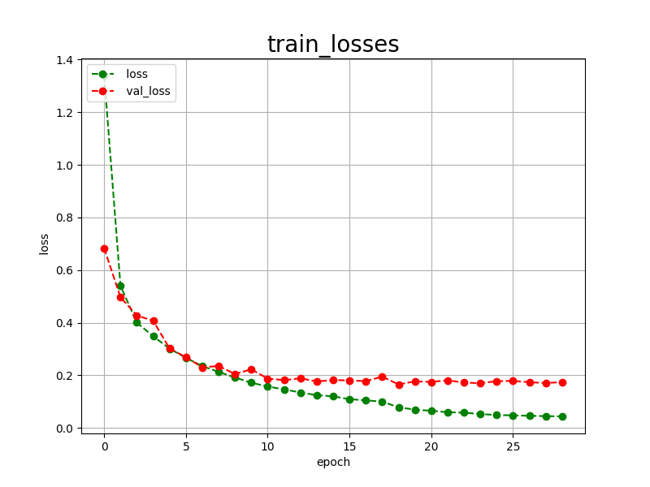
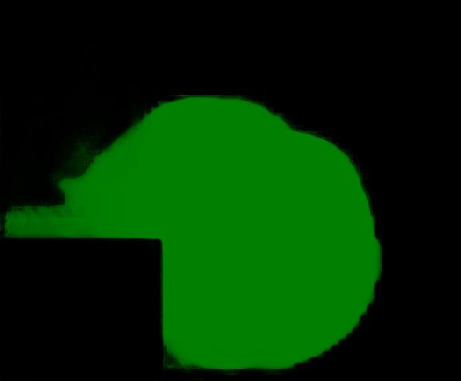

<h2>Tensorflow-Image-Segmentation-Gastrointestinal-Polyp (2024/11/06)</h2>

This is the second experiment of Image Segmentation for Brain Tumor
 based on 
the latest <a href="https://github.com/sarah-antillia/Tensorflow-Image-Segmentation-API">Tensorflow-Image-Segmentation-API</a>, and
<a href="https://drive.google.com/file/d/1T2Ue66UY_UYnNncsdsAR2soZfyocO4w1/view?usp=sharing">
Gastrointestinal-Polyp-ImageMask-Dataset.zip</a>, which was derived by us from  
<a href="https://www.kaggle.com/datasets/debeshjha1/kvasirseg">
Kvasir-SEG Data (Polyp segmentation & detection)
</a>
 
 
Please see also our first experiment 
<a href="https://github.com/atlan-antillia/Image-Segmentation-Gastrointestinal-Polyp">Image-Segmentation-Gastrointestinal-Polyp
</a>
 

<b>Actual Image Segmentation for Images of 622x531 pixels</b> 
As shown below, the inferred masks look similar to the ground truth masks.  

<table>
<tr>
<th>Input: image</th>
<th>Mask (ground_truth)</th>
<th>Prediction: inferred_mask</th>
</tr>
<tr>
<td></td>
<td></td>
<td></td>
</tr>

<tr>
<td></td>
<td></td>
<td></td>
</tr>

<tr>
<td></td>
<td></td>
<td></td>
</tr>
</table>

 
In this experiment, we used the simple UNet Model 
<a href="./src/TensorflowUNet.py">TensorflowSlightlyFlexibleUNet</a> for this Gastrointestinal-PolypSegmentation Model. 
As shown in <a href="https://github.com/sarah-antillia/Tensorflow-Image-Segmentation-API">Tensorflow-Image-Segmentation-API</a>.
you may try other Tensorflow UNet Models: 

<li><a href="./src/TensorflowSwinUNet.py">TensorflowSwinUNet.py</a></li>
<li><a href="./src/TensorflowMultiResUNet.py">TensorflowMultiResUNet.py</a></li>
<li><a href="./src/TensorflowAttentionUNet.py">TensorflowAttentionUNet.py</a></li>
<li><a href="./src/TensorflowEfficientUNet.py">TensorflowEfficientUNet.py</a></li>
<li><a href="./src/TensorflowUNet3Plus.py">TensorflowUNet3Plus.py</a></li>
<li><a href="./src/TensorflowDeepLabV3Plus.py">TensorflowDeepLabV3Plus.py</a></li>

 

<h3>1. Dataset Citation</h3>
 Kvasir-SEG Data (Polyp segmentation & detection)
<a href="https://www.kaggle.com/datasets/debeshjha1/kvasirseg">
https://www.kaggle.com/datasets/debeshjha1/kvasirseg
</a>
 
 
<b>About Dataset</b> 
<b>Kvasir-SEG information</b>: 
The Kvasir-SEG dataset (size 46.2 MB) contains 1000 polyp images and their corresponding ground truth from the Kvasir Dataset v2. 

The images' resolution in Kvasir-SEG varies from 332x487 to 1920x1072 pixels. The images and its corresponding masks are stored 
in two separate folders with the same filename. The image files are encoded using JPEG compression, facilitating online browsing. 
The open-access dataset can be easily downloaded for research and educational purposes.
 
 
<b>Applications of the Dataset</b> 
The Kvasir-SEG dataset is intended to be used for researching and developing new and improved methods for segmentation, 
detection, localization, and classification of polyps. Multiple datasets are prerequisites for comparing computer 
vision-based algorithms, and this dataset is useful both as a training dataset or as a validation dataset. 
These datasets can assist the development of state-of-the-art solutions for images captured by colonoscopes from different 
manufacturers. Further research in this field has the potential to help reduce the polyp miss rate and thus improve examination quality. 
The Kvasir-SEG dataset is also suitable for general segmentation and bounding box detection research. In this context, the datasets 
can accompany several other datasets from a wide range of fields, both medical and otherwise.
 
 
<b>Ground Truth Extraction</b> 
We uploaded the entire Kvasir polyp class to Labelbox and created all the segmentations using this application. 

The Labelbox is a tool used for labeling the region of interest (ROI) in image frames, i.e., the polyp regions for our case. 
We manually annotated and labeled all of the 1000 images with the help of medical experts. After annotation, we exported the files to generate masks for each annotation. The exported JSON file contained all the information about the image and the coordinate 
points for generating the mask. To create a mask, we used ROI coordinates to draw contours on an empty black image and fill the 
contours with white color. The generated masks are a 1-bit color depth images. The pixels depicting polyp tissue, the region of 
interest, are represented by the foreground (white mask), while the background (in black) does not contain positive pixels. 
Some of the original images contain the image of the endoscope position marking probe, ScopeGuide TM, Olympus Tokyo Japan, 
located in one of the bottom corners, seen as a small green box. As this information is superfluous for the segmentation task, 
we have replaced these with black boxes in the Kvasir-SEG dataset
 .
<h3>
<a id="2">
2 Gastrointestinal-PolypImageMask Dataset
</a>
</h3>
 If you would like to train this Gastrointestinal-PolypSegmentation model by yourself,
 please download the dataset from the google drive 
<a href="https://drive.google.com/file/d/1T2Ue66UY_UYnNncsdsAR2soZfyocO4w1/view?usp=sharing">
Gastrointestinal-Polyp-ImageMask-Dataset.zip</a>,
, expand the downloaded ImageMaskDataset and put it under <b>./dataset</b> folder to be
<pre>
./dataset
└─Gastrointestinal-Polyp
    ├─test
    │   ├─images
    │   └─masks
    ├─train
    │   ├─images
    │   └─masks
    └─valid
        ├─images
        └─masks
</pre>

<b>Gastrointestinal-Polyp Statistics</b> 
 
 
As shown above, the number of images of train and valid datasets is enough to use for a training set of our segmentation model.
 
 
<b>Train_images_sample</b> 

 
<b>Train_masks_sample</b> 

 

<h3>
3 Train TensorflowUNet Model
</h3>
 We have trained Gastrointestinal-PolypTensorflowUNet Model by using the following
<a href="./projects/TensorflowSlightlyFlexibleUNet/Gastrointestinal-Polyp/train_eval_infer.config"> <b>train_eval_infer.config</b></a> file.  
Please move to ./projects/TensorflowSlightlyFlexibleUNet/Gastrointestinal-Polypand run the following bat file. 
<pre>
>1.train.bat
</pre>
, which simply runs the following command. 
<pre>
>python ../../../src/TensorflowUNetTrainer.py ./train_eval_infer.config
</pre>

<b>Model parameters</b> 
Defined a small <b>base_filters</b> and large <b>base_kernels</b> for the first Conv Layer of Encoder Block of 
<a href="./src/TensorflowUNet.py">TensorflowUNet.py</a> 
and a large num_layers (including a bridge between Encoder and Decoder Blocks).
<pre>
[model]
base_filters   = 16
base_kernels   = (7,7)
num_layers     = 8
</pre>

<b>Learning rate</b> 
Defined a small learning rate.  
<pre>
[model]
learning_rate  = 0.00005
</pre>

<b>Online augmentation</b> 
Disabled our online augmentation.  
<pre>
[model]
model         = "TensorflowUNet"
generator     = False
</pre>

<b>Loss and metrics functions</b> 
Specified "bce_dice_loss" and "dice_coef". 
<pre>
[model]
loss           = "bce_dice_loss"
metrics        = ["dice_coef"]
</pre>
<b>Learning rate reducer callback</b> 
Enabled learing_rate_reducer callback, and a small reducer_patience.
<pre> 
[train]
learning_rate_reducer = True
reducer_factor     = 0.4
reducer_patience   = 4
</pre>

<b>Early stopping callback</b> 
Enabled early stopping callback with patience parameter.
<pre>
[train]
patience      = 10
</pre>

<b>Epoch change inference callbacks</b> 
Enabled epoch_change_infer callback. 
<pre>
[train]
epoch_change_infer       = True
epoch_change_infer_dir   =  "./epoch_change_infer"
epoch_changeinfer        = False
epoch_changeinfer_dir    = "./epoch_changeinfer"
num_infer_images         = 6
</pre>

By using this callback, on every epoch_change, the inference procedure can be called
 for 6 images in <b>mini_test</b> folder. This will help you confirm how the predicted mask changes 
 at each epoch during your training process.    

<b>Epoch_change_inference output</b> 
 
 

In this experiment, the training process was stopped at epoch 29  by EarlyStopping Callback.  
 
 

<a href="./projects/TensorflowSlightlyFlexibleUNet/Gastrointestinal-Polyp/eval/train_metrics.csv">train_metrics.csv</a> 
 

 
<a href="./projects/TensorflowSlightlyFlexibleUNet/Gastrointestinal-Polyp/eval/train_losses.csv">train_losses.csv</a> 
 

 

<h3>
4 Evaluation
</h3>
Please move to a <b>./projects/TensorflowSlightlyFlexibleUNet/Gastrointestinal-Polyp</b> folder, 
and run the following bat file to evaluate TensorflowUNet model for Gastrointestinal-Polyp. 
<pre>
./2.evaluate.bat
</pre>
This bat file simply runs the following command.
<pre>
python ../../../src/TensorflowUNetEvaluator.py ./train_eval_infer_aug.config
</pre>

Evaluation console output: 

  Image-Segmentation-CDD-CESM-Gastrointestinal-Polyp

<a href="./projects/TensorflowSlightlyFlexibleUNet/Gastrointestinal-Polyp/evaluation.csv">evaluation.csv</a> 

The loss (bce_dice_loss) to this Gastrointestinal-Polyp/test was not low, and dice_coef not high as shown below.
 
<pre>
loss,0.2602
dice_coef,0.8047
</pre>
 

<h3>
5 Inference
</h3>
Please move to a <b>./projects/TensorflowSlightlyFlexibleUNet/Gastrointestinal-Polyp</b> folder 
,and run the following bat file to infer segmentation regions for images by the Trained-TensorflowUNet model for Gastrointestinal-Polyp. 
<pre>
./3.infer.bat
</pre>
This simply runs the following command.
<pre>
python ../../../src/TensorflowUNetInferencer.py ./train_eval_infer_aug.config
</pre>

<b>mini_test_images</b> 
 
<b>mini_test_mask(ground_truth)</b> 
 

<b>Inferred test masks</b> 
 
 

<b>Enlarged images and masks </b> 

<table>
<tr>
<th>Image</th>
<th>Mask (ground_truth)</th>
<th>Inferred-mask</th>
</tr>

<tr>
<td></td>
<td></td>
<td></td>
</tr>

<tr>
<td></td>
<td></td>
<td></td>
</tr>

<tr>
<td></td>
<td></td>
<td></td>
</tr>
<tr>
<td></td>
<td></td>
<td></td>
</tr>
<tr>
<td></td>
<td></td>
<td></td>
</tr>
<tr>
<td></td>
<td></td>
<td></td>
</tr>
</table>

 

<h3>
References
</h3>

<b>1. Kvasir-SEG Data (Polyp segmentation & detection)</b> 
<a href="https://www.kaggle.com/datasets/debeshjha1/kvasirseg">
https://www.kaggle.com/datasets/debeshjha1/kvasirseg
</a>
 
 
<b>2. Kvasir-SEG: A Segmented Polyp Dataset</b> 
Debesh Jha, Pia H. Smedsrud, Michael A. Riegler, P˚al Halvorsen, 
Thomas de Lange, Dag Johansen, and H˚avard D. Johansen 
<a href="https://arxiv.org/pdf/1911.07069v1.pdf">
https://arxiv.org/pdf/1911.07069v1.pdf
</a>
 
 
<b>3. Image-Segmentation-Gastrointestinal-Polyp</b> 
Toshiyuki Arai @antillia.com 
<a href="https://github.com/atlan-antillia/Image-Segmentation-Gastrointestinal-Polyp">
https://github.com/atlan-antillia/Image-Segmentation-Gastrointestinal-Polyp
</a>
 

